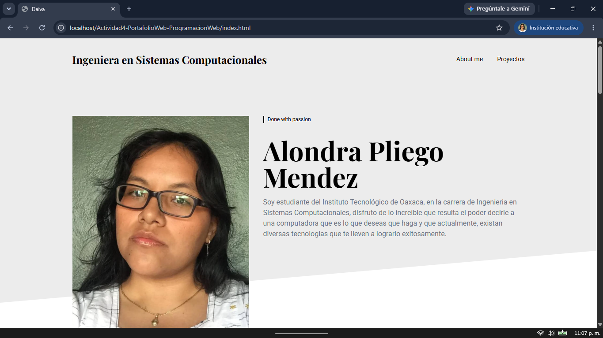
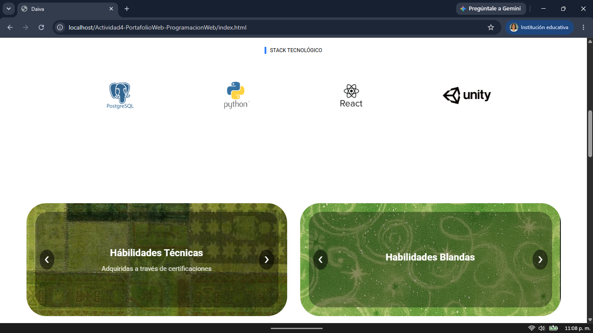
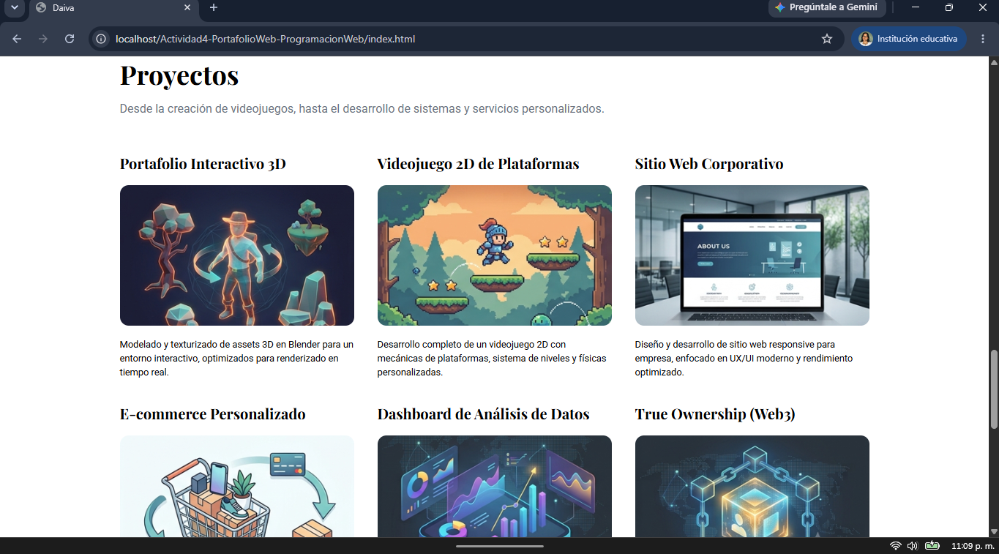
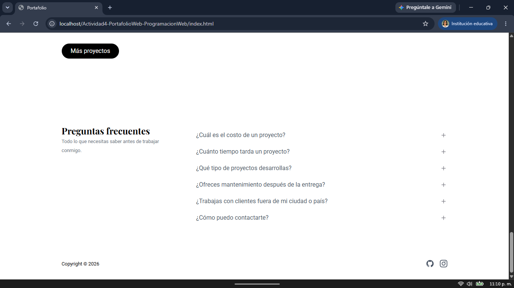
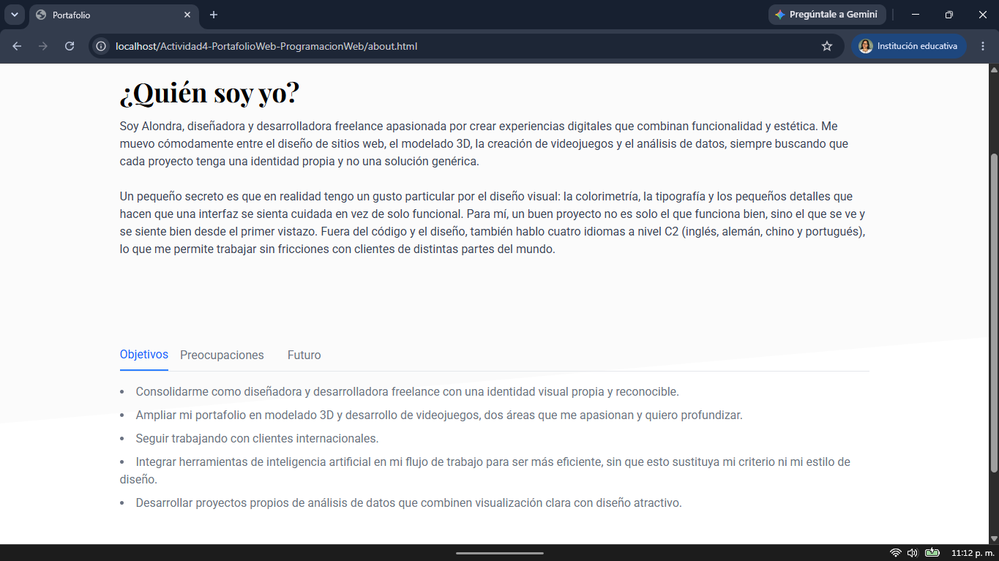
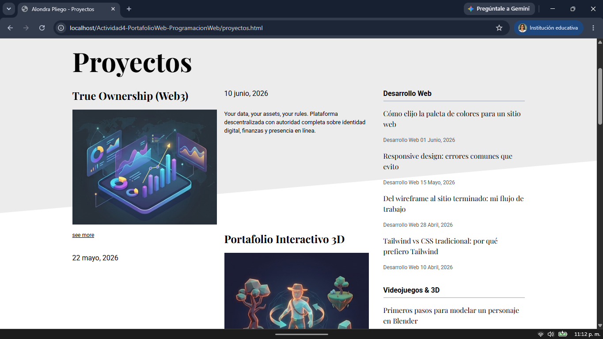

# Creación de Portafolio a Través de una Plantilla

Portafolio construido con HTML, CSS y JS.

**Objetivo**Crear un portafolio basado en una plantilla de Bootstrap o Tailwind CSS, documentar su uso en GitHub y publicarlo en GitHub Pages.  
---

**Actividad 4 - Programación Web**

Tecnológico Nacional de México, Instituto Tecnológico de Oaxaca

**Alumna:** Pliego Mendez Alondra

## Descripcion del proyecto
La creación de un portafolio en donde podamos presentar evidencia tangible de habilidades, creatividad y experiencia es de suma importancia para la inserción en el mundo laboral, ya sea como freelancer o buscando formar parte de una empresa, es por ello también que es necesario conocer al menos una estructura básica del mismo.
Para la realización de este portafolio se utiliza el framework css conocido como Tailwind dado que gracias a su flexibilidad permite la personalización a libertad del desarrollador. 
La plantilla tomada como base es la siguiente:

En si no es como tal una plantilla para portafolio sin embargo debido a su estructura bien definida por secciones la hizo facil de implementar, además de que sigue un estilo bastante sobrio que me permitio explorar diferentes colores en lugares específicos.
### Sitio de descarga de la plantilla
- https://github.com/lbegey/tw-daiva-tpl
- https://www.tailawesome.com/resources/daiva
### Secciones que componen el portafolio 
- Inicio: En principio cuando el portafolio se carga lo primero que se muestra es una fotografía personal, y un pequeño texto que habla sobre que haces actualmente.
- Stack tecnologico: En esta parte se muestran las tecnologias con las que se encuentren más familiarizados.
- Habilidades: Hay dos carruseles, uno para las habilidades técnicas aquellas que adquieres por certificaciones o academicamente, y uno para las habilidades blandas donde mencionas las cualidades que tienes como persona que ayudan a potenciar tus habilidades.
- Proyectos: Una presentación y descripción a grandes rasgos de los proyectos que has desarrollado, incluye un boton que envia a la página de proyectos donde se profundiza más en ellos.
- Preguntas frecuentes: Sección en donde se deja en claro la linea de trabajo que se sigue.
- Contacto: Se deja el número celular y correro electrónico. En el pie de la página se coloca también el acceso directo a GitHub e instagram.
- Sobre mi: Apartado en donde se profundiza sobre la persona que eres, cual es tu eslilo de trabajo, fortalezas, debilidades y objetivos. Creada con el objetivo de establecer un lazo más humano con el cliente.
## Proceso de creación
1. Buscar una plantilla disponible en Tailwind que coincida con los requisitos de un portafolio o una que se encuentre bien dividida que sea sencilla de adaptar y personalizar (se optó por la segunda).
2. Tomar un curriculum vitae como base de organización para el portafolio.
3. Definir qué sección de la plantilla va a tomar cada elemento que queremos presentar.
4. Modificar los nombres, logos e hipervínculos principales para que hagan referencia al portafolio y sus secciones.
5. Cambiar la imagen principal por una fotografía personal del dueño del portafolio, así como una descripción simple sobre quién era, logrando así una introducción.
6. Adaptar una sección de información con el componente visual personalizado realizado en la actividad anterior (el carrusel de imagenes) solo que en su lugar mostraran texto, dividiéndolos en dos secciones: habilidades técnicas y habilidades blandas.
7. Reemplazar la sección de proyectos genérica por seis proyectos relacionados con la carrera e intereses para el portafolio, en este caso se cubrieron áreas como modelado 3D, desarrollo de videojuegos, diseño de sitios web y análisis de datos, ajustando el layout de una fila horizontal a una cuadrícula para que los seis se acomodaran de forma ordenada.
8. Sustituir la sección que antes decía "All in one!" por la sección de idiomas certificados y agregar imagenes de banderas representativas de cada idioma (inglés, alemán, chino y portugués).
9. Reescribir la sección de preguntas frecuentes con dudas reales que un cliente podría tener (costo, tiempos de entrega, tipo de proyectos, mantenimiento, trabajo remoto), agregando además una pregunta final con los datos de contacto.
10. Ajustar el footer para enlazar directamente a las redes sociales reales relacionadas, por ejemplo GitHub para un contacto más de exploración e instagram para un contacto más directo.
11. Adaptar la sección de blog para reflejar los proyectos y temas reales del portafolio en lugar del contenido de ejemplo de la plantilla, se conserva la misma estructura base.
12. Redactar la sección de "¿Quién soy yo?" con una descripción personal que destacara la pasión por el diseño, la colorimetría y el dominio de varios idiomas como diferenciador profesional.
13. Desarrollamos las pestañas de objetivos, preocupaciones y futuro, convirtiendo los objetivos y preocupaciones en listas concretas.
## Muestra de funcionamiento del portafolio

## Links
### GitHub Pages
- https://alondrapliego.github.io/Actividad4-PortafolioWeb-ProgramacionWeb/
### GitHub Repositorio
- https://github.com/AlondraPliego/Actividad4-PortafolioWeb-ProgramacionWeb